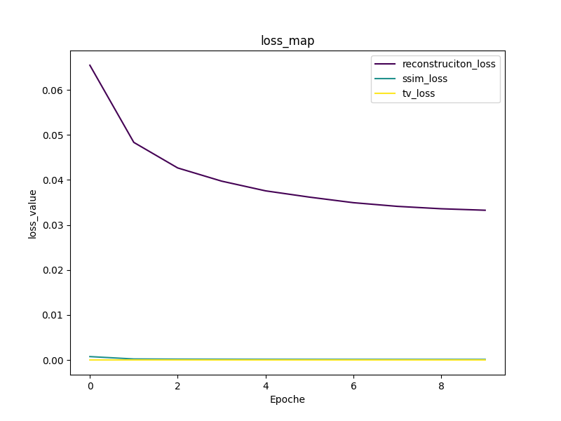

# Deep-Learning-for-Image-Denoising-A-Neural-Restoration-Framework
A survey on fundamental and extensive deep learning networks for image restoration and denoising. 

## Requirments
I have developed this project using 
> `python3 : Python 3.8.10` 
> `torch : 1.5.0+cu101`  `torchvison: 0.6.0+cu101`
>  
for getting the required librariese try to run the command:
> `pip install -r requirements.txt`

all the experiments have been done using a single **TeslaT4** on **Google Colab**. 

## Training
for training thre model try to run the `inference/main.ipynb` file 
**Notice:** 
> For configurating the project try using the `config.json` file.
> options on `config.json`:
* `model`: the architecture of the model.
  * `U-net` , `"VAE"`
* `save_weight_path`: the checkpoint folder for saving the model weigths in .pt format and the loss maps.
  * `null` ,`defined_path` 
* `load_weigth_path`: for loading the checkpoint path fro the model.
  * `null` ,`defined_path` 
* `datset`: defining the desired dataset for teh experiment.
  * `STL10` , `Cifar100` 
* `device` : the device used for training the model on:
  * `"cpu"` ,  `"cuda"`
  
# Inference with denoising 
in this project, our aim is to denoise images with the defined noise:

* gaussian noise : type of noise which we can gather in the nature and denoising it is essential for digital image processing an daccuracy checking in most restoration frameworks.
   
* salt-peper noise : type of noise which limits several pixels signal strength to MAX and MIN intensity value.
   
* uniform noise : type of noise which we constantly face in domain adaption frameworks and digital cameras.

in order to denoise the image in the with following noise types, we made some deep learning models(made between 2013 - 2021) inorder to encode the images and reduce the effect of noises on images and the latent space manifold.
we use the `STL10 dataset` test set for training on the models with `batch-size = 4`, and `num-workers = 2` using `cuda` device.

##  Loss-map & Outputs
in order to solve the task we used the following losses on the models:
* `reconstruction_loss`: to retrieve the missing pixels of the noisy input images and the original one, use an l1-loss.

* `ssim_loss`: for making the output images distribution authentic and similar to the  original images distibution.    

* `total_variation_loss`: used for smoothing the sharp unnatural edges and removing  ghosting  artifacts.

* `kl_divergence_loss`: used for making the distribusion of the latent space similar to the original images. 
  
the loss map for U-net model is depicted as follow:

> 

and the outputs for the input images are:
>
